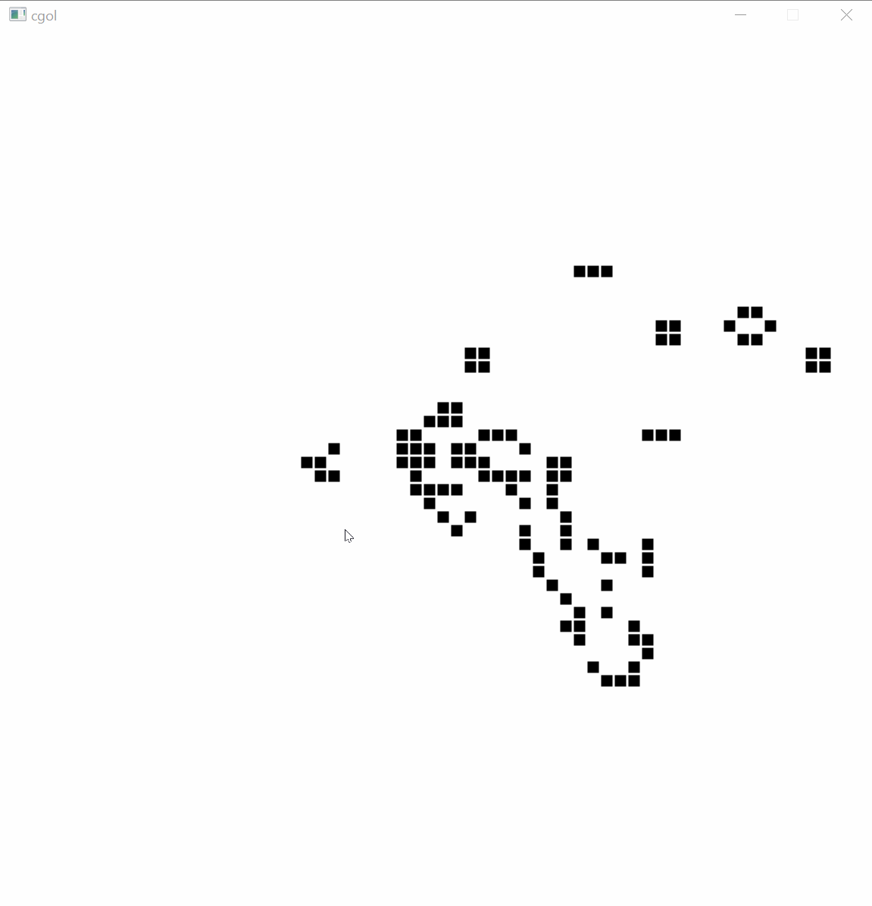

# cgol

A simple implemention of Conway's Game of Life using SDL2.

## Usage

* Spacebar: Toggle seed mode to change the state of cells in the world.
* Right click:  Toggle seed mode.
* Left click:  Toggle the state of a cell.  Only works in seed mode.
* 'F' key: Speed up the simulation to a min of 1/10th per second.
* 'S' key: Slow down the simulation to a max of once per second.

By default the simulation updates twice per second but can be adjusted
in 0.1 second increments using the 'F' and 'S' keys.  This is capped to
the range of [0.1, 1.0].  The frame rate is capped to 30 FPS.

## Building

### Mac OS

Run `setup.bash` to download the SDL2 dependency to the vendor directory
then run `build_mac.bash`.

### Windows

This assumes you have Visual Studio 2017 or greater installed on your machine.

* First open a Visual Studio developer command prompt.  The most straight
  forward way to do this is hit the Windows key to search and start typing
  "command".  The search will show several options.  Pick the one that specifies
  to build in x64 (e.g. "x64 Native Tools Command Prompt for VS 20XX").
* Navigate to the root directory of this project.
* Run `setup.bat` to download the SDL2 dependency.  This assumes a more recent
  version of Windows (2018 or later) that comes with curl installed.
* Run `build.bat`.

### Linux

I currently don't have a Linux environment to test things but `setup.bash`
should work without changes.  To build you will have to modify `build_mac.bash`
to remove the MacOS specifics.

## License

MIT
